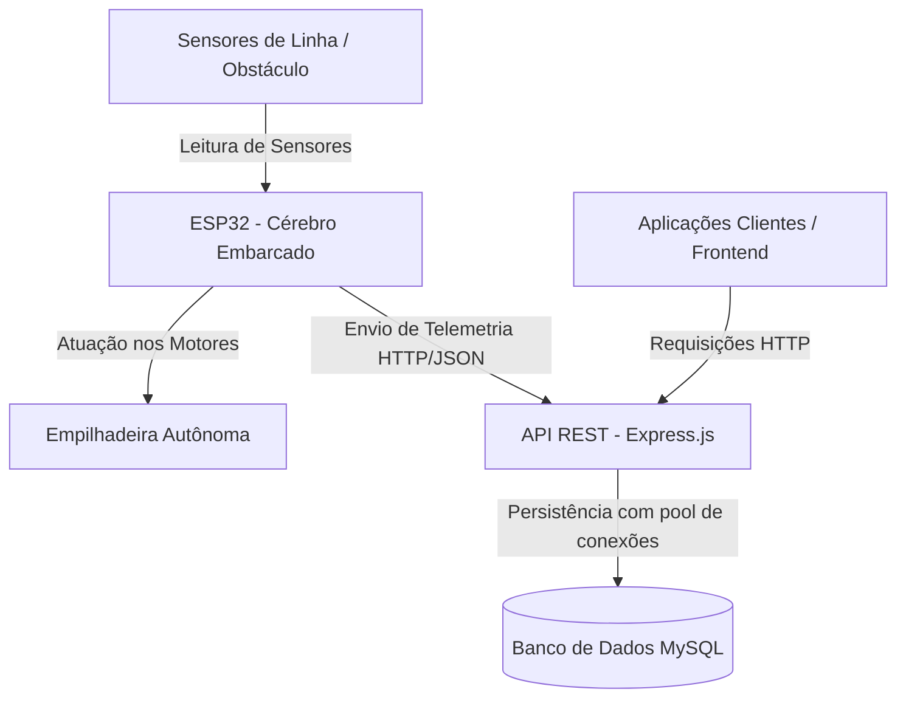
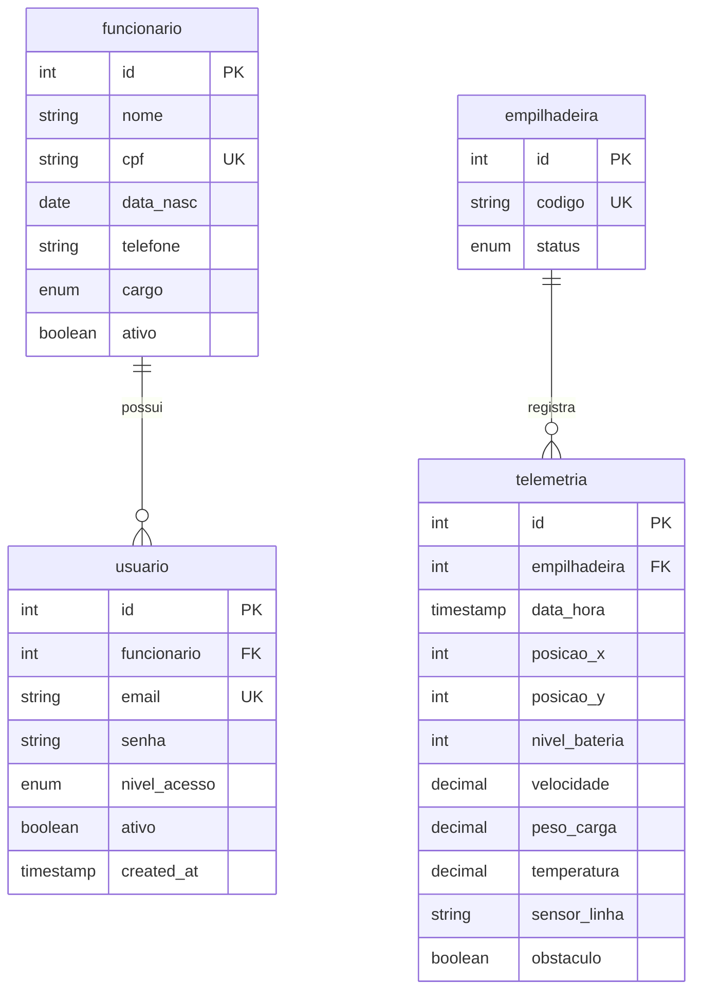

# Empilhadeira Autônoma Seguidora de Linha — API Backend

> **⚠️ Nota Importante sobre o Projeto:**  
> Este repositório é parte integrante de um **Trabalho de Conclusão de Curso (TCC) que ainda está em desenvolvimento**.  
> O projeto consiste no desenvolvimento e controle de uma **empilhadeira autônoma que segue linha**, utilizando a placa **ESP32 como o "cérebro" do projeto**.  
> O ESP32 é responsável por **controlar a empilhadeira** e também por **enviar informações de telemetria para a API**.  
> Por se tratar de um projeto em desenvolvimento ativo, **podem ocorrer alterações futuramente**, tanto na estrutura do repositório quanto nas tecnologias, funcionalidades, banco de dados e arquitetura do sistema.

---

## 📋 Sumário
- [Descrição do Projeto](#-descrição-do-projeto)
- [Contexto do TCC](#-contexto-do-tcc)
- [Objetivo do Projeto](#-objetivo-do-projeto)
- [Funcionamento Geral](#-funcionamento-geral)
- [Papel do ESP32](#-papel-do-esp32)
- [Tecnologias Utilizadas](#-tecnologias-utilizadas)
- [Arquitetura do Projeto](#-arquitetura-do-projeto)
- [Estrutura de Pastas](#-estrutura-de-pastas)
- [Banco de Dados](#-banco-de-dados)
  - [SGBD Utilizado](#sgbd-utilizado)
  - [Estrutura e Relacionamentos das Tabelas](#estrutura-e-relacionamentos-das-tabelas)
- [API](#-api)
  - [Endpoints Mapeados](#endpoints-mapeados)
  - [Padronização de Respostas HTTP](#padronização-de-respostas-http)
- [Instalação e Configuração](#-instalação-e-configuração)
- [Variáveis de Ambiente](#-variáveis-de-ambiente)
- [Como Executar o Projeto](#-como-executar-o-projeto)
- [Estado Atual do Desenvolvimento](#-estado-atual-do-desenvolvimento)
- [Próximos Passos](#-próximos-passos)
- [Observações](#-observações)

---

## 📝 Descrição do Projeto

O **empilhadeira-api** é o sistema de backend desenvolvido em Node.js e Express para suporte à operação de uma empilhadeira autônoma. A API é responsável pelo gerenciamento de cadastros operacionais (funcionários e usuários), controle de status da frota de empilhadeiras e recepção de dados de telemetria transmitidos em tempo real pelo microcontrolador da empilhadeira.

---

## 🎓 Contexto do TCC

Este software faz parte de um **Trabalho de Conclusão de Curso (TCC)** focado na integração de conceitos de **Internet das Coisas (IoT)**, **Sistemas Embarcados**, **Robótica Autônoma** e **Desenvolvimento de APIs REST**.

Por ser um projeto acadêmico e experimental em andamento:
* A estrutura da API, schemas de validação e modelo relacional estão sendo evoluídos gradativamente.
* Novas rotas, integrações com o hardware e refatorações de código serão implementadas conforme os testes de bancada e de pista avançarem.

---

## 🎯 Objetivo do Projeto

O objetivo principal do ecossistema é prover uma solução automatizada de logística interna, contemplando:
1. **Navegação Autônoma:** Orientação de uma empilhadeira ao longo de uma pista demarcada por linha.
2. **Telemetria em Tempo Real:** Registro contínuo de status operacional (posição $X, Y$, nível de bateria, velocidade, peso de carga, temperatura, leitura de sensores de linha e detecção de obstáculos).
3. **Gestão Operacional e Autenticação:** Controle de acesso e gerenciamento de funcionários e usuários da aplicação.

---

## ⚙️ Funcionamento Geral



1. O microcontrolador **ESP32** instalado na empilhadeira efetua a leitura dos sensores e executa a lógica de movimentação para seguir a linha.
2. Simultaneamente, o **ESP32** agrega informações de telemetria do veículo.
3. Os dados de telemetria são transmitidos via rede sem fio para a **API Node.js/Express**.
4. A API valida a estrutura dos dados recebidos através de middlewares e schemas **Zod** e armazena os registros no banco **MySQL**.

---

## 🧠 Papel do ESP32

O microcontrolador **ESP32** é o **"cérebro" embarcado** do projeto:

* **Controle da Empilhadeira:** Responsável por ler os sensores de linha e obstáculo e acionar os motores da empilhadeira para mantê-la sobre a linha demarcada e parar em caso de imprevistos.
* **Envio de Informações para a API:** Coleta periodicamente dados operacionais e os envia para os endpoints da API de backend.
* **Comunicação:** A estrutura de banco de dados (`telemetria`) já está preparada para receber medições de posição ($X, Y$), bateria, velocidade, carga, temperatura e estado dos sensores transmitidos pelo ESP32.

*(Nota: O firmware do ESP32 e a integração final via requisições HTTP para os endpoints de telemetria estão na fase de planejamento e desenvolvimento).*

---

## 🛠️ Tecnologias Utilizadas

### Backend & Core
* **Node.js**: Ambiente de execução JavaScript (configurado como ES Modules via `"type": "module"` no `package.json`).
* **Express.js (`^5.2.1`)**: Framework web para criação da API REST.
* **CORS (`^2.8.6`)**: Middleware para habilitação de requisições *Cross-Origin*.
* **Dotenv (`^17.4.2`)**: Carregamento de variáveis de ambiente.

### Validação & Criptografia
* **Zod (`^4.4.3`)**: Definição de schemas e validação rigorosa de dados de entrada.
* **Argon2 (`^0.45.1`)**: Algoritmo seguro para hashing de senhas.

### Banco de Dados
* **MySQL**: Sistema Gerenciador de Banco de Dados Relacional (SGBD).
* **MySQL2 (`^3.23.3`)**: Cliente MySQL para Node.js utilizando *Promises* e *Connection Pool*.

### Ferramentas de Desenvolvimento
* **Nodemon (`^3.1.14`)**: Ferramenta de desenvolvimento para *live-reloading* do servidor.

---

## 📐 Arquitetura do Projeto

O projeto utiliza uma arquitetura baseada em funcionalidades (**Feature-Based Architecture**), dividida nas seguintes camadas principais:

* **`server.js`**: Ponto de entrada do servidor HTTP Express, responsável por carregar middlewares globais, porta e mapear as rotas.
* **`mapRoutes.js`**: Centralizador responsável por iterar e registrar todas as rotas de módulos na aplicação.
* **`src/core/`**: Contém as configurações centrais e conexões de infraestrutura:
  * **`config/config.js`**: Objeto com credenciais e parâmetros de conexão do banco de dados.
  * **`database/pool.js`**: Instância singleton do pool de conexões do MySQL2 (`mysql.createPool`).
  * **`database/db.sql`**: Script DDL de criação e estruturação do banco de dados.
* **`src/features/`**: Contém os módulos de domínio da aplicação. Cada módulo (ex: `funcionario`) segue a estrutura em 5 camadas:
  1. **Router (`router.js`)**: Define os caminhos e atribui handlers às rotas Express.
  2. **Controller (`controller.js`)**: Gerencia o ciclo de requisição/resposta HTTP.
  3. **Service (`service.js`)**: Isola as regras de negócio da aplicação.
  4. **Repository (`repository.js`)**: Executa as queries SQL no banco de dados.
  5. **DTO (`dto.js`)**: Schemas de validação Zod para payload de entrada.
* **`src/middlewares/`**: Middlewares globais reutilizáveis, como o `validate.js` para validação dinâmica de requisições com Zod.
* **`src/utils/`**: Utilitários auxiliares, incluindo `response.js` para padronização de respostas JSON.

---

## 📁 Estrutura de Pastas

A estrutura atual de arquivos e diretórios do repositório é a seguinte:

```text
empilhadeira-api/
├── .gitignore
├── README.md
├── mapRoutes.js
├── package-lock.json
├── package.json
├── server.js
└── src/
    ├── core/
    │   ├── config/
    │   │   └── config.js
    │   └── database/
    │       ├── db.sql
    │       └── pool.js
    ├── features/
    │   └── funcionario/
    │       ├── controller.js
    │       ├── dto.js
    │       ├── repository.js
    │       ├── router.js
    │       └── service.js
    ├── middlewares/
    │   └── validate.js
    └── utils/
        └── response.js
```

---

## 🗄️ Banco de Dados

### SGBD Utilizado
* **MySQL** (manipulado via driver `mysql2` com pool de conexões).

### Script DDL
O arquivo [`src/core/database/db.sql`] define a criação do banco de dados `empilhadeira` e de suas tabelas.

### Diagrama Relacional (MER)



### Descrição das Tabelas, Colunas e Relacionamentos

#### 1. Tabela `funcionario`
Armazena o cadastro dos funcionários do sistema.
* **`id`**: `INT UNSIGNED PRIMARY KEY AUTO_INCREMENT` — Identificador único.
* **`nome`**: `VARCHAR(50) NOT NULL` — Nome do funcionário.
* **`cpf`**: `CHAR(11) NOT NULL UNIQUE` — Número de CPF (apenas dígitos).
* **`data_nasc`**: `DATE NOT NULL` — Data de nascimento.
* **`telefone`**: `VARCHAR(11) NULL` — Telefone de contato (opcional).
* **`cargo`**: `ENUM("operador", "supervisor", "tecnico", "gerente") DEFAULT "operador"` — Cargo desempenhado.
* **`ativo`**: `BOOL DEFAULT TRUE` — Status de atividade do cadastro.

#### 2. Tabela `usuario`
Armazena dados de acesso e autenticação dos usuários do sistema.
* **`id`**: `INT UNSIGNED PRIMARY KEY AUTO_INCREMENT` — Identificador único.
* **`funcionario`**: `INT UNSIGNED NOT NULL` — Chave estrangeira que referencia `funcionario(id)`.
* **`email`**: `VARCHAR(255) NOT NULL UNIQUE` — E-mail de login.
* **`senha`**: `VARCHAR(255) NOT NULL` — Senha criptografada (hash Argon2).
* **`nivel_acesso`**: `ENUM("operador", "supervisor", "admin")` — Perfil de permissão.
* **`ativo`**: `BOOL DEFAULT TRUE` — Status da conta.
* **`created_at`**: `TIMESTAMP DEFAULT CURRENT_TIMESTAMP` — Data de criação.
* **Relacionamento:** `usuario.funcionario` ➔ `funcionario.id` (Chave Estrangeira).

#### 3. Tabela `empilhadeira`
Cadastra as unidades físicas das empilhadeiras.
* **`id`**: `INT UNSIGNED PRIMARY KEY AUTO_INCREMENT` — Identificador único.
* **`codigo`**: `VARCHAR(100) NOT NULL UNIQUE` — Código identificador do veículo.
* **`status`**: `ENUM("disponivel", "operando", "parada") DEFAULT "disponivel"` — Estado de operação do veículo.

#### 4. Tabela `telemetria`
Registra as leituras enviadas pelos sensores do ESP32 acoplado à empilhadeira.
* **`id`**: `INT UNSIGNED PRIMARY KEY AUTO_INCREMENT` — Identificador da leitura.
* **`empilhadeira`**: `INT UNSIGNED NOT NULL` — Chave estrangeira que referencia `empilhadeira(id)`.
* **`data_hora`**: `TIMESTAMP DEFAULT CURRENT_TIMESTAMP` — Carimbo de data/hora do registro.
* **`posicao_x`**: `INT UNSIGNED` — Posição X da empilhadeira.
* **`posicao_y`**: `INT UNSIGNED` — Posição Y da empilhadeira.
* **`nivel_bateria`**: `INT UNSIGNED` — Nível percentual de bateria.
* **`velocidade`**: `DECIMAL(5,2)` — Velocidade instantânea.
* **`peso_carga`**: `DECIMAL(8,2)` — Peso medido da carga.
* **`temperatura`**: `DECIMAL(5,2)` — Temperatura medida.
* **`sensor_linha`**: `VARCHAR(100)` — Estado/leitura dos sensores de linha.
* **`obstaculo`**: `BOOL DEFAULT FALSE` — Sinalização de detecção de obstáculo.
* **Relacionamento:** `telemetria.empilhadeira` ➔ `empilhadeira.id` (Chave Estrangeira).
* **Índice:** `idx_telemetria_data_hora` criado na coluna `data_hora` para otimização de consultas temporais.

---

## 🌐 API

### Endpoints Mapeados

O roteamento da API é centralizado em [`mapRoutes.js`]:

| Prefixo HTTP | Arquivo Router | Status Atual da Rota | Finalidade / Módulo |
| :--- | :--- | :--- | :--- |
| `/api/funcionario` | `src/features/funcionario/router.js` | Módulo criado. Lógica do controller (`FuncionarioController.create`), serviço (`FuncionarioService.create`), repositório (`INSERT INTO funcionario`) e DTO (`funcionarioSchema`) implementadas. *As rotas HTTP específicas ainda precisam ser explicitamente vinculadas no objeto Router.* | Gestão e cadastro de funcionários. |

### Padronização de Respostas HTTP

O utilitário [`src/utils/response.js`] padroniza todos os retornos JSON da API com a seguinte estrutura de objeto:

```json
{
  "success": true,
  "status": 200,
  "message": "Operação realizada com sucesso",
  "error": "",
  "data": null,
  "quant": 0
}
```

---

## 💻 Instalação e Configuração

### Pré-requisitos
* **Node.js** (versão 18 ou superior)
* **MySQL** (servidor em execução localmente ou remotamente)

### Passos para Instalação

1. Clone o repositório do projeto:
   ```bash
   git clone https://github.com/Vit7977/empilhadeira-api.git
   cd empilhadeira-api
   ```

2. Instale as dependências listadas no `package.json`:
   ```bash
   npm install
   ```

3. Importe a estrutura do banco de dados MySQL:
   Execute o script SQL localizado em `src/core/database/db.sql` utilizando seu cliente MySQL preferido ou via terminal:
   ```bash
   mysql -u root -p < src/core/database/db.sql
   ```

---

## 🔑 Variáveis de Ambiente

O projeto importa a biblioteca `dotenv`. Atualmente, as configurações de conexão utilizam os seguintes parâmetros padrão no código (definidos em [`src/core/config/config.js`]e [`server.js`]):

* **Porta da API (`API_PORT`)**: `3000` *(se não definida no ambiente)*
* **Host do Banco**: `localhost`
* **Porta do Banco**: `3306`
* **Usuário do Banco**: `root`
* **Senha do Banco**: `""` *(vazia por padrão)*
* **Nome do Banco**: `empilhadeira`

---

## 🚀 Como Executar o Projeto

Para rodar o servidor em ambiente de desenvolvimento com reinicialização automática via **Nodemon**:

```bash
npm run dev
```

Ao iniciar, o terminal exibirá a confirmação:
```text
API: http://localhost:3000
```

---

## 📊 Estado Atual do Desenvolvimento

A tabela abaixo resume o status real de cada componente com base no código analisado:

| Componente / Recurso | Status | Descrição |
| :--- | :--- | :--- |
| **Servidor Express (server.js)** | 🟢 **Implementado** | Servidor ativo com suporte a CORS, JSON parser e carregamento dinâmico de rotas via `mapRoutes.js`. |
| **Pool de Conexão MySQL (pool.js)** | 🟢 **Implementado** | Conexão criada usando `mysql2/promise` com gerenciamento de pool de conexões. |
| **Modelagem de Dados (db.sql)** | 🟢 **Implementado** | Tabelas `funcionario`, `usuario`, `empilhadeira` e `telemetria` mapeadas com chaves primárias, estrangeiras e índices. |
| **Middleware de Validação (validate.js)** | 🟢 **Implementado** | Validador genérico integrado com Zod `safeParse`. |
| **Utilitário de Resposta (response.js)** | 🟢 **Implementado** | Formatador padrão de respostas HTTP (200, 201, 400, 401, 403, 404, 409, 500). |
| **Módulo Funcionario** | 🟡 **Parcialmente Implementado** | DTOs (Zod), Controller, Service e Repository criados para inclusão de funcionário. Falta declarar os métodos de rota (ex: `router.post('/')`) no `router.js`. |
| **Módulo Usuario** | 🔴 **Planejado** | Tabela SQL existente; dependência `argon2` instalada. Camadas de rotas e controllers a desenvolver. |
| **Módulo Empilhadeira** | 🔴 **Planejado** | Tabela SQL existente. Camadas de rotas e controllers a desenvolver. |
| **Módulo Telemetria** | 🔴 **Planejado** | Tabela SQL existente. Endpoints de recebimento dos dados do ESP32 a desenvolver. |
| **Firmware e Comunicação ESP32** | 🔴 **Planejado** | Integração do ESP32 com os endpoints HTTP da API a ser implementada na fase de hardware. |

---

## 🔮 Próximos Passos

Principais etapas identificadas para a continuidade do projeto:

1. **Vincular Rotas no `FuncionarioRouter`**: Associar o `FuncionarioController.create` com a rota `POST /` aplicando o middleware `validate(funcionarioSchema)`.
2. **Desenvolver o Módulo de Usuários**: Criar as camadas DTO, Repository, Service e Controller para `usuario`, implementando criptografia de senha com `argon2`.
3. **Desenvolver Módulo de Empilhadeiras**: Implementar cadastro e atualização de status (`disponivel`, `operando`, `parada`).
4. **Desenvolver Módulo de Telemetria**: Criar endpoints REST para permitir o envio periódico de dados de sensores pelo ESP32.
5. **Implementar Firmware no ESP32**: Programar a lógica de seguimento de linha e envio das requisições HTTP para a API.

---

## 📌 Observações

* **Projeto de TCC em Desenvolvimento:** O código e a estrutura apresentados refletem o estado atual do repositório e passarão por evoluções contínuas ao longo do projeto.
* **Integridade do Código:** Nenhuma alteração foi realizada na lógica dos arquivos do repositório para a criação deste arquivo `README.md`.